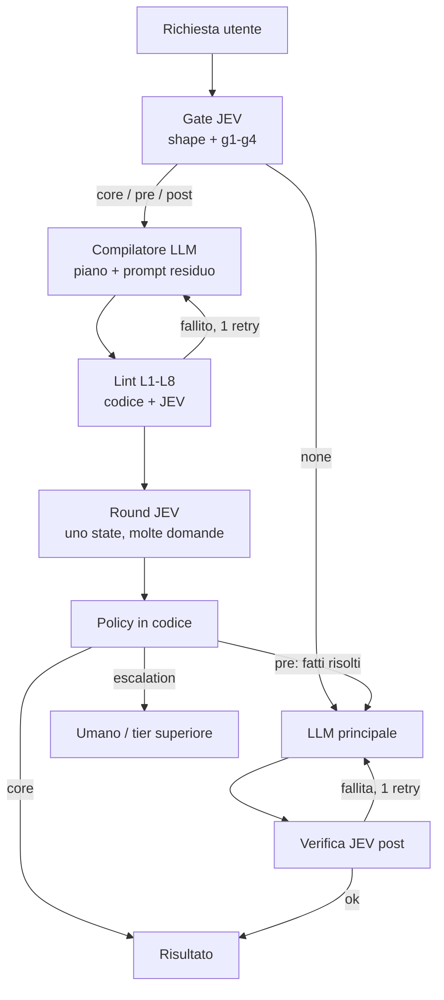

# JEV Prompt Compiler — Specifica e banco di prova

2026-09-21 · @Someone

## Scopo e principi

Il compilatore riceve una richiesta qualsiasi e produce un piano: decide se le primitive JEV (Noul, Score, Choice) servono, scompone la richiesta in State + Questions tipizzate e riscrive il prompt per l'LLM principale. Non risponde mai alla richiesta.

Tre principi guidano ogni scelta:

- **Modello di costo.** Lo state si paga una volta, le domande N volte a costo quasi nullo. La decomposizione massimizza le domande per state, non il numero di state. Uno state con una sola domanda perde sempre contro una chiamata LLM diretta.
- **JEV è il pane, non il ripieno.** JEV decide e verifica; non genera. Si innesta prima della generazione (routing, classificazione, precondizioni) e dopo (verifica del prodotto). Il contenuto generativo resta all'LLM.
- **Decisione separata dalla policy.** JEV restituisce probabilità e confidence; soglie e aggregazioni vivono in codice, versionate a parte, mai dentro le domande.

Il valore concreto è il **prompt residuo**: l'LLM riceve le decisioni già prese come fatti, invece di doverle prendere e generare nello stesso passaggio.

## Pipeline

Il gate JEV decide se serve un piano; il compilatore lo produce solo in quel caso e il lint lo controlla prima dell'esecuzione. Esecuzione, soglie e sintesi stanno fuori, in componenti separati.



Il ciclo di verifica post si ripete al massimo una volta; al secondo fallimento si scala.

## Classificazione e gate

Ogni richiesta ricade in una di quattro forme; la forma determina il ruolo di JEV. È la decisione su cui il sistema vince o perde.

| task\_shape | Definizione | jev\_role tipico | Esempio |
| --- | --- | --- | --- |
| judgment | La risposta è una decisione o valutazione su un artefatto dato | core | "Questa mail è un reclamo? Quanto è urgente?" |
| generative | Il deliverable è testo, codice o documento nuovo | post (o none) | "Scrivi una proposta commerciale" |
| mixed | Serve una decisione prima di generare bene | pre+post | "Rispondi a questo ticket nel tono giusto" |
| extraction | La risposta appartiene a un insieme aperto (nomi, numeri, fatti) | none | "Chi ha firmato il contratto?" |

Il gate imposta `jev_role = none` salvo che valga almeno una condizione:

1. almeno 3 giudizi indipendenti sullo stesso state;
2. serve una probabilità calibrata che guida una decisione a valle;
3. lo stesso giudizio va applicato a molti item con criteri identici;
4. un output generativo va verificato prima della consegna (solo post).

Un singolo giudizio che l'LLM principale può dare in contesto non basta. Il gate stesso può girare su JEV: il banco di prova ne misura costo (\~2 × 10⁻⁵ USD) e accuratezza.

## Contratto di output

Il compilatore emette un solo oggetto JSON; con `jev_role = none` restano solo i primi tre campi e `residual_prompt` coincide con la richiesta originale.

```json
{
  "task_shape": "judgment | generative | mixed | extraction",
  "jev_role": "none | core | pre | post | pre+post",
  "gate_rationale": "una frase",
  "asks": ["Self-contained sentence for each thing the request asks for"],
  "states": {
    "S1": { "source": "user_input | llm_output", "content": "...", "pruned_fields": [] }
  },
  "rounds": [
    { "round": 1, "state": "S1",
      "questions": [
        { "id": "q1", "type": "noul", "role": "pre", "instructions": "..." },
        { "id": "q2", "type": "score", "role": "pre", "instructions": "...",
          "criteria": [ { "what": "...", "examples": ["..."] } ] },
        { "id": "q3", "type": "choice", "role": "pre", "instructions": "...",
          "options": [ { "id": "...", "what": "..." } ] }
      ] }
  ],
  "policy": [
    { "when": "q2.score >= 2 AND q2.confidence >= 0.5", "then": "set urgency=high" },
    { "when": "any.confidence < 0.5", "then": "escalate" }
  ],
  "residual_prompt": "Prompt riscritto con placeholder {{q1}}, {{q3}}",
  "post_checks": [
    { "id": "v1", "type": "noul", "state": "llm_output + brief",
      "instructions": "Does the output address every requirement in the brief?" }
  ]
}
```

| Campo | Ruolo |
| --- | --- |
| states | Contenuto valutato, già potato dei campi che nessuna domanda usa |
| rounds | Esistono solo per le dipendenze: una domanda dipendente va al round successivo |
| policy | Regole dichiarative sugli id delle domande, eseguite in codice |
| residual\_prompt | Il prompt ottimizzato per l'LLM; i placeholder ricevono gli esiti risolti come fatti |
| post\_checks | Al massimo 3 Noul di verifica contro il brief originale |

Dalla v0.2 `asks` è obbligatorio: è l'input dei controlli di copertura L5 e L6 del lint.

## Prompt del compilatore

Testo di sistema v0.4, validato sul tier default con 8 piani corretti su 8 (vedi "Quarto giro"). È in inglese perché genera istruzioni per JEV. Rispetto alla v0.2 aggiunge: state come segnaposto dell'input, round riservati a pre/core, esempi degli Score sempre in lista e livelli dal basso all'alto, costrutti `for_each` e `criteria_from`, divieto di aggiunte esteso ai post check, prompt residuo obbligatorio sui ruoli non core, escalation anche sui piani solo post e due esempi completi.

```text
You are a JEV planning compiler. You never answer the user's request and you never see its input data: the plan is compiled BEFORE the input arrives.
Output ONLY one JSON object with exactly these keys:
task_shape, jev_role, gate_rationale, asks, states, rounds, policy, residual_prompt, post_checks.

SCHEMA
- asks: array of strings, each a self-contained English sentence.
- states: object id -> {source, content}. content is a placeholder for runtime input such as "{{customer_message}}" or {"cv":"{{cv}}","requirements":"{{requirements}}"}. Never describe the input in words.
- rounds: array of {round, state, questions}. Rounds contain ONLY questions with role "pre" or "core". Verification of generated output NEVER goes in rounds.
- question: {id, type, role, instructions, criteria, for_each?, criteria_from?}
  - noul: criteria null.
  - score: criteria is an array ordered from LOWEST to HIGHEST level; each item {what: string, examples: [string, ...]} (examples is ALWAYS an array).
  - choice: criteria is an array of {id, what}; include "other" unless provably exhaustive.
  - for_each: optional placeholder of a runtime collection (e.g. "{{reviews}}"). The question is a template applied to each element; refer to the element as 'item' in instructions.
  - criteria_from: optional placeholder of a runtime list of criteria (e.g. "{{requirements}}"). The question is a template instantiated once per criterion; refer to it as 'criterion' in instructions.
- policy: array of {when, then}.
- residual_prompt: string, or null ONLY when jev_role is "core".
- post_checks: array of {id, type:"noul", instructions}; the ONLY place for output verification.

RULES
1. Gate: keep the given task_shape and jev_role. Missing input data is NEVER a reason to downgrade: input arrives at runtime.
2. Items and criteria:
   - if they are named in the request text, write one question for each;
   - if they exist only in the runtime input (a list of reviews, log entries, the requirements of a job ad), write ONE template question with for_each or criteria_from;
   - never collapse them into one holistic judgment, never hide "for each" inside the instructions text.
3. Questions are atomic, in English, with no thresholds; phrase noul so "yes" is the high value; if a score's lowest level means "absent", do not add a noul for presence.
4. Policy: every plan has an escalation rule. With questions: confidence < 0.5 -> escalate. Post-only plans: a post check still failing after one regeneration -> escalate. Conditional parts of the request ("if X, then Y") become policy rules; aggregations and thresholds live here.
5. No additions, anywhere. Neither residual_prompt nor post_checks may add tone, length, structure, content or quality requirements the user did not write.
   - residual_prompt (post, pre, pre+post): same language as the request; rephrase it replacing delegated decisions with {{qN}} placeholders; if nothing was delegated, copy the request VERBATIM. Never null for these roles.
     Bad: "Rispondi alle recensioni. Riconosci il problema e indica azioni correttive."  Good: "Rispondi alle recensioni negative. Esito della verifica per recensione: {{q1}}."
   - post_checks: one noul per ask about the generated output, at most 4, each verifying only something the user asked for.
     Bad: "Is the tone professional?" when the user never mentioned tone.

EXAMPLE 1 (mixed)
Request: "Questa mail di reclamo va girata all'ufficio legale? Se sì scrivi la nota di inoltro." Gate: mixed, pre+post.
{"task_shape":"mixed","jev_role":"pre+post","gate_rationale":"Decision first, then a note.","asks":["Decide whether the complaint email must be forwarded to the legal office.","If so, write a forwarding note."],"states":{"S1":{"source":"user_input","content":"{{complaint_email}}"}},"rounds":[{"round":1,"state":"S1","questions":[{"id":"q1","type":"noul","role":"pre","instructions":"Does the email contain a legal threat, a claim for damages or a reference to lawyers or courts?","criteria":null}]}],"policy":[{"when":"q1 < 0.5","then":"no forwarding; tell the user"},{"when":"any.confidence < 0.5","then":"escalate"}],"residual_prompt":"Scrivi la nota di inoltro all'ufficio legale per questa mail di reclamo. Motivo dell'inoltro: {{q1}}.","post_checks":[{"id":"v1","type":"noul","instructions":"Does the note state why the email is being forwarded to the legal office?"}]}

EXAMPLE 2 (collection known only at runtime)
Request: "Dimmi quali di questi ordini sono stati spediti all'indirizzo sbagliato." Gate: judgment, core.
{"task_shape":"judgment","jev_role":"core","gate_rationale":"Same judgment over a runtime collection.","asks":["For each order, decide whether it was shipped to the wrong address."],"states":{"S1":{"source":"user_input","content":{"orders":"{{orders}}"}}},"rounds":[{"round":1,"state":"S1","questions":[{"id":"q1","type":"noul","role":"core","for_each":"{{orders}}","instructions":"Does the shipping address of 'item' differ from the customer's address on record in 'item'?","criteria":null}]}],"policy":[{"when":"q1 >= 0.5","then":"list the order as wrong address"},{"when":"any.confidence < 0.5","then":"escalate that order"}],"residual_prompt":null,"post_checks":[]}
```

## Regole per domande e policy

La forma della domanda determina la primitiva; ciò che non ha un insieme di risposte chiuso non è JEV.

| Forma della domanda | Primitiva | Vincolo |
| --- | --- | --- |
| Presenza, assenza, conformità, detection | Noul | "yes" = valore alto/positivo |
| Grandezza ordinata (rischio, severità, qualità, effort) | Score | Ogni livello con `what` + esempi, livelli non sovrapposti |
| Tassonomia chiusa, routing | Choice | Opzioni mutuamente esclusive, "other" salvo esaustività provata |
| Insieme aperto (nome, numero, entità) | Nessuna | È estrazione: resta all'LLM |

Vincoli sulle domande:

- **Atomicità**: ogni domanda si risponde senza l'esito delle altre; se dipende, va al round successivo.
- **Niente soglie nelle domande**: la ricalibrazione deve essere possibile senza toccare i prompt.
- **Giudizi olistici**: uno Score unico, non una scomposizione in Noul ricomposta con una formula inventata. Si scompone solo dove una rubrica esiste già (checklist, compliance, naming).

Vincoli sulle policy:

- regola di escalation obbligatoria per confidence < 0.5 (nel dubbio si sale, mai si scende);
- conteggi e somme pesate calcolati in codice, mai richiesti a JEV;
- verifica post ripetuta al massimo una volta prima di scalare.

## Banco di prova

Il gate, implementato con JEV stesso, ha classificato correttamente 15 casi su 15, sia per task\_shape sia per jev\_role (jev-1.13.0, 21/09/2026). Il risultato è ottimistico: dataset, etichette e domande sono dello stesso autore.

**Metodo.** Una chiamata `jev_ask` per richiesta: state = `{request}`, cinque domande indipendenti (una Choice `shape` + quattro Noul `g1`–`g4`, una per condizione di gate). Il `jev_role` è calcolato in codice con soglia 0,5:

```text
extraction -> none
judgment   -> core se max(g1,g2,g3) > 0.5, altrimenti none
generative -> post se g4 > 0.5, altrimenti none
mixed      -> pre+post
```

| ID | Richiesta | Atteso | Ottenuto | Segnale decisivo |
| --- | --- | --- | --- | --- |
| C01 | 50 recensioni: sentiment, prezzo, rimborso | judgment / core | judgment / core | g1 0,97 · g3 0,98 |
| C02 | Lettera di presentazione da inviare all'azienda | generative / post | generative / post | g4 0,94 |
| C03 | Risposta a cliente arrabbiato, tono ed escalation | mixed / pre+post | mixed / pre+post | shape 0,98 |
| C04 | Data di scadenza nel contratto | extraction / none | extraction / none | shape 1,00 |
| C05 | Questo snippet ha un bug? | judgment / none | judgment / none | g1–g3 ≤ 0,15 |
| C06 | Traduci un paragrafo | generative / none | generative / none | g4 0,17 |
| C07 | 200 transazioni: sospetta frode? | judgment / core | judgment / core | g3 0,98 |
| C08 | CV contro 6 requisiti | judgment / core | judgment / core | g1 0,58 · g2 0,58 (borderline) |
| C09 | Riassunto verbale per il CdA | generative / post | generative / post | g4 0,95 |
| C10 | Riassunto veloce di un articolo | generative / none | generative / none | g4 0,16 |
| C11 | 300 ticket da assegnare a reparto | judgment / core | judgment / core | g3 0,96 |
| C12 | Giorni a Natale | extraction / none | extraction / none | shape 1,00 |
| C13 | Scegli il team e scrivi l'handover | mixed / pre+post | mixed / pre+post | shape 1,00 |
| C14 | 40 documenti: istruzioni nascoste per AI? | judgment / core | judgment / core | g3 0,97 |
| C15 | Frase grammaticalmente corretta? | judgment / none | judgment / none | g1–g3 ≤ 0,10 |

**Costo misurato.** Circa 560 token in input e 120 in output per richiesta, \~2,4 × 10⁻⁵ USD e 600–800 ms per chiamata; 15 casi ≈ 0,00035 USD.

**Debolezze emerse.**

- **g1 è rumoroso**: su casi con un solo giudizio ripetuto su molti item risponde \~0,5 (C11 0,52, C14 0,51), confondendo "tre giudizi" con "molti item". Non ha causato errori solo perché g3 era netto.
- **g2 è poco informativo**: oscilla tra 0,38 e 0,77 senza separare i casi. Riformulato in v2 (vedi Decisioni aperte): la nuova versione separa i casi decisionali e toglie C08 dalla zona borderline.
- **C08 è deciso da margini di 0,08** sopra soglia: è il caso che romperebbe per primo con formulazioni diverse.
- **Dataset facile**: le richieste esplicitano quantità ("50", "200") e destinatari. Mancano casi ambigui, richieste lunghe, richieste in inglese e multi-intento.

**Scoperta di progetto.** Il costo misurato del gate (\~2 × 10⁻⁵ USD) smentisce la regola "non usare JEV per decidere se usare JEV": l'overhead reale è la latenza, non il costo. Diventa praticabile un gate JEV davanti al compilatore LLM, che viene invocato solo quando `jev_role ≠ none`.

## Banco di prova v2

Con g1, g2 e g3 riformulati il gate classifica 30 casi nuovi su 30, dopo aver corretto un'etichetta (V12) che il sistema contesta in modo coerente su 4 formulazioni diverse. Senza la correzione: 29/30.

**Domande di gate v2** (policy invariata, soglia 0,5):

| Id | Testo | Cambiato perché |
| --- | --- | --- |
| shape | Choice judgment / generative / mixed / extraction (come v1, "explanation" aggiunta a generative) | — |
| g1 | "Does `request` ask for three or more different kinds of assessment about each item? Count kinds of question, not number of items." | v1 confondeva "più giudizi" con "molti item" |
| g2 | "Is the purpose of `request` to decide what happens next to the items (approve, reject, block, escalate, assign), rather than to produce information or text?" | v1 non separava i casi |
| g3 | "Does `request` refer to an open collection of items (plural nouns such as tickets, emails, commits…), each needing the same judgment, rather than a single item or a fixed set of three or fewer?" | v1 falliva senza quantità esplicite (V14 a 0,49) |
| g4 | Invariato | — |

**Dataset v2**: 30 richieste, 9 in inglese, nessuna con quantità numerica tranne V29, una lunga (V11), quattro multi-intento.

| ID | Richiesta | Atteso | Ottenuto | Segnale decisivo |
| --- | --- | --- | --- | --- |
| V01 | Flag urgent support tickets (EN) | judgment / core | judgment / core | g3 0,94 |
| V02 | LinkedIn post per nuovo prodotto (EN) | generative / post | generative / post | g4 0,68 |
| V03 | Fatture del trimestre con importi anomali | judgment / core | judgment / core | g3 0,95 |
| V04 | Contratto: rinnovo, penali, limitazioni, rischio | judgment / core | judgment / core | g1 0,87 |
| V05 | Come funziona OAuth2 | generative / none | generative / none | g4 0,08 |
| V06 | Riscrivi email più cortese | generative / none | generative / none | g4 0,33 |
| V07 | Review positive or negative? (EN) | judgment / none | judgment / none | max 0,08 |
| V08 | Chi ha proposto la soluzione nel thread | extraction / none | extraction / none | shape 1,00 |
| V09 | Candidatura avanti o no + mail di esito | mixed / pre+post | mixed / pre+post | shape 1,00 |
| V10 | Log: critici, noti, da intervenire | judgment / core | judgment / core | g1 0,81 · g3 0,85 |
| V11 | Intro di 2 minuti per presentazione al cliente (lunga) | generative / post | generative / post | g4 0,88 |
| V12 | Quale di tre offerte conviene | ~~judgment / core~~ judgment / none | judgment / none | max 0,34 — etichetta corretta |
| V13 | Media voti della classe | extraction / none | extraction / none | shape 1,00 |
| V14 | Commit della settimana che toccano sicurezza | judgment / core | judgment / core | g3 0,94 (v1: 0,49, errore) |
| V15 | Funzione SQL fatturato mensile | generative / none | generative / none | g4 0,12 |
| V16 | Moderate forum comments (EN) | judgment / core | judgment / core | g2 0,65 · g3 0,92 |
| V17 | Il saggio regge l'argomentazione? | judgment / none | judgment / none | max 0,08 |
| V18 | Rispondi a recensioni negative fondate | mixed / pre+post | mixed / pre+post | shape 1,00 |
| V19 | Meteo Roma domani | extraction / none | extraction / none | shape 0,99 |
| V20 | PR su leggibilità, test, performance, sicurezza | judgment / core | judgment / core | g1 0,96 |
| V21 | Manuale in tedesco per pubblicazione | generative / post | generative / post | g4 0,84 |
| V22 | Approve this expense report? (EN) | judgment / core | judgment / core | g2 0,86 |
| V23 | Tre nomi per app fitness | generative / none | generative / none | g4 0,13 |
| V24 | Email in spam, lavoro, personale | judgment / core | judgment / core | g3 0,89 |
| V25 | Sintesi sondaggio per il management | generative / post | generative / post | g4 0,87 |
| V26 | Minaccia di recesso? Se sì risposta di retention | mixed / pre+post | mixed / pre+post | shape 1,00 |
| V27 | Estrai indirizzi email | extraction / none | extraction / none | shape 1,00 |
| V28 | Tono adatto a primo contatto? | judgment / none | judgment / none | max 0,10 |
| V29 | Which of 12 applicants to interview + invitations (EN) | mixed / pre+post | mixed / pre+post | shape 1,00 |
| V30 | Differenza IFRS 15 / IFRS 16 | generative / none | generative / none | g4 0,15 |

**Correzione di V12.** L'etichetta iniziale (core) era mia e discutibile: una scelta singola tra tre opzioni è un giudizio che l'LLM principale dà in contesto, esattamente il caso che il gate deve escludere. Il sistema risponde none su V12 e sulle sue 3 parafrasi, quindi ho corretto l'etichetta invece della soglia.

**Segnali ancora deboli.** g4 su V02 (0,68) e V06 (0,33) mostra che "pubblicazione" e "email" sono letti con incertezza; V16 ha shape con confidence 0,61 (judgment vs mixed), che la policy manderebbe in escalation.

**Costo**: 5 chiamate batch per 42 richieste, \~0,00069 USD totali, 0,6–0,9 s ciascuna.

## Stabilità

Su 4 casi borderline riformulati 3 volte (2 in italiano, 1 in inglese) il gate prende la stessa decisione in 12 parafrasi su 12. La lingua non sposta le probabilità in modo rilevante.

| Gruppo | Origine | Decisione | Segnale per parafrasi (IT · IT · EN) | Esito |
| --- | --- | --- | --- | --- |
| PA — CV contro requisiti | C08 (borderline in v1) | judgment / core | g2 0,84 · 0,75 · 0,76 | stabile; in v1 lo decidevano g1/g2 a 0,58 |
| PB — scelta tra 3 offerte | V12 | judgment / none | max 0,39 · 0,23 · 0,38 | stabile; motiva la correzione dell'etichetta |
| PC — saggio convincente | V17 | judgment / none | max 0,12 · 0,08 · 0,10 | stabile |
| PD — 40 documenti, prompt injection | C14 | judgment / core | g3 0,95 · 0,94 · 0,95 | stabile |

Il gruppo PB è il più vicino alla soglia (g2 fino a 0,39): una scelta tra opzioni è letta come decisione solo in parte. Se in futuro si vorranno trattare le scelte tra fornitori come core, va aggiunto un esempio esplicito di "select among options" alla formulazione di g2.

## Compilatore completo

Ho generato i piani per tre casi (V04 core, V21 post, V26 pre+post) e li ho fatti valutare da JEV con una checklist di 6 Noul: il controllo ha trovato un difetto reale nel piano pre+post, che dopo la correzione è passato. La conseguenza è una nuova fase: un **lint JEV del piano** prima dell'esecuzione.

| Check di qualità | V04 core | V21 post | V26 pre+post v1 | V26 v2 |
| --- | --- | --- | --- | --- |
| Domande atomiche | 0,74 | 0,78 | 0,53 | 0,87 |
| Nessuna soglia nelle domande | 0,79 | 0,96 | 0,85 | — |
| Score ancorati | 0,95 | 0,97 | 0,95 | — |
| Prompt residuo fedele all'originale | 0,98 | 0,45 | **0,08** | 0,82 |
| Regola di escalation presente | 0,99 | 0,99 | 0,99 | — |
| Copertura della richiesta | 0,87 | 0,61 | 0,69 | 0,70 |

**Difetto trovato (V26 v1).** Il prompt residuo aggiungeva requisiti non richiesti: "proponi un'azione concreta; tono professionale ed empatico". Inoltre q1 ("intende recedere?") era ridondante con il livello 0 dello Score q2. Correzione: rimosse le aggiunte, q1 assorbito da q2 con la regola `q2.score < 1 → nessuna retention`.

Piano V26 corretto:

```json
{
  "task_shape": "mixed", "jev_role": "pre+post",
  "states": { "S1": { "source": "user_input", "content": "{{customer_message}}" } },
  "rounds": [{ "round": 1, "state": "S1", "questions": [
    { "id": "q2", "type": "score", "instructions": "How firmly does `customer_message` express an intention to leave?",
      "criteria": [
        { "what": "No mention of leaving", "examples": ["not happy with the last delivery"] },
        { "what": "Leaving mentioned as a possibility", "examples": ["we might look at other options"] },
        { "what": "Conditional ultimatum", "examples": ["if this is not fixed by Friday we will cancel"] },
        { "what": "Formal notice of cancellation", "examples": ["please consider this our notice of termination"] } ] },
    { "id": "q3", "type": "choice", "instructions": "What is the main reason for dissatisfaction in `customer_message`?",
      "options": ["price", "service", "product", "competitor", "other"] } ] }],
  "policy": [
    { "when": "q2.score < 1", "then": "not a threat: tell the user, no retention reply" },
    { "when": "q2.score >= 3", "then": "notify account manager and draft reply" },
    { "when": "any.confidence < 0.5", "then": "escalate" } ],
  "residual_prompt": "Prepara una risposta di retention a questo messaggio del cliente. Contesto già valutato: motivo principale {{q3}}, intensità della minaccia {{q2}}.",
  "post_checks": [
    { "id": "v1", "type": "noul", "instructions": "Does `reply` address the specific reason for dissatisfaction?" },
    { "id": "v2", "type": "noul", "instructions": "Is `reply` written in the same language as `customer_message`?" } ]
}
```

**Limiti di questa prova.**

- I piani li ho scritti io (modello di fascia alta), non un modello economico: la qualità del compilatore sul tier previsto resta da misurare.
- Il check "prompt residuo fedele" ha dato un falso negativo su V21 (0,45 con prompt identico all'originale): la clausola "rispondi sì se null" confonde. Nella v2 ho sostituito la clausola con "i placeholder di contesto non contano".
- "Copertura" resta tra 0,61 e 0,87 su tutti i piani: la domanda è troppo generica. V21 non verifica la qualità da pubblicazione (fluidità), una lacuna vera; negli altri casi il segnale è rumore.

## Lint del piano

Il lint va diviso in due: cinque controlli sono deterministici e si fanno in codice, solo tre richiedono JEV. La copertura generica viene sostituita da una verifica per singola richiesta, che ha trovato le due lacune reali dei piani di prova.

**Nuovo campo nel contratto**: `asks`, l'elenco delle richieste contenute nella domanda originale, ciascuna come **frase autosufficiente** ("The result must be fit for publication on the website"), mai come frammento citato.

| Id | Controllo | Dove | Regola |
| --- | --- | --- | --- |
| L1 | Schema JSON valido | codice | validazione contro il contratto |
| L2 | Nessuna soglia nelle domande | codice | regex su cifre e comparatori nelle `instructions` |
| L3 | Score ancorati | codice | ogni livello ha `what` e almeno un `examples` |
| L4 | Escalation presente | codice | esiste una regola su `confidence < 0.5` |
| L5 | Ask trasmessi | codice / JEV | se `residual_prompt` è identico all'originale → tutti trasmessi; altrimenti un Noul JEV per ask |
| L6 | Ask verificati (solo ruoli post) | JEV | un Noul per ask: "Is `asks[i]` directly verified by at least one post check?" |
| L7 | Domande atomiche | JEV | come nel test del compilatore |
| L8 | Prompt residuo senza aggiunte | JEV | come nel test del compilatore |

**Test su V21 e V26 v2** (ask verificati, L6):

| Ask | Forma frase autosufficiente | Forma frammento citato | Atteso |
| --- | --- | --- | --- |
| V21 — tradurre il manuale | 0,62 | 0,55 | sì (v1) |
| V21 — in tedesco | 0,95 | 0,90 | sì (v2) |
| V21 — adatto alla pubblicazione | **0,22** | 0,79 (errato) | no: lacuna reale |
| V26 — risposta di retention | **0,39** | 0,35 | no: lacuna reale |

La forma frammento sbaglia anche L5: "per la pubblicazione sul sito" risulta non trasmesso (0,10) pur comparendo alla lettera nel prompt residuo. È il motivo per cui L5 va in codice quando possibile.

**Lacune trovate e correzioni ai piani**:

- V21: aggiungere `v4` "Is `translation` fluent and idiomatic enough to publish without further editing?"
- V26: aggiungere `v3` "Does `reply` try to retain the customer with a concrete fix, offer or commitment?"

**Policy del lint**: è consultivo, non bloccante. Un controllo JEV sotto 0,5 rimanda il piano al compilatore una volta, con il controllo fallito come feedback; al secondo fallimento il piano procede con un avviso. I controlli in codice falliti bloccano sempre.

## Decisioni aperte e prossimi passi

La decisione raccomandata è adottare l'architettura a due stadi: gate JEV sempre attivo, compilatore LLM invocato solo quando il gate restituisce un ruolo diverso da `none`.

| Decisione | Raccomandazione | Motivo |
| --- | --- | --- |
| Dove gira il gate | JEV (`jev_ask`, 5 domande) | 15/15 corretti, \~2 × 10⁻⁵ USD, < 1 s |
| Dove gira il compilatore | Modello economico (tier Haiku/Sonnet) con few-shot | Compito strutturale; invocato solo sui casi utili |
| Modello JEV | Pinnare `jev-1.13.0` | Le soglie sono tarate su questa versione |
| g2 (decisione a valle) | Riformulare o rimuovere | Riformulato (v2): "Is the purpose of \`request\` to decide what happens next to the items (approve, reject, block, escalate, assign to someone), rather than to produce information or text?". Sui judgment separa nettamente: sì C07 0,61, C08 0,80, C11 0,80; no C01/C05/C15 ≤ 0,09; C14 0,23. Testato in batch, da riverificare nel formato single-state |

Prossimi passi:

- [x] Riformulare g1 separando "più giudizi sullo stesso item" da "stesso giudizio su molti item" (fatto, anche g3)
- [x] Banco v2 con 30 casi ambigui, lunghi, multi-intento, in inglese, senza quantità esplicite (30/30 dopo correzione di V12)
- [x] Stabilità su parafrasi (12/12 decisioni coerenti)
- [x] Compilatore completo su 3 casi con lint JEV dei piani (1 difetto reale trovato e corretto)
- [x] Etichette da un secondo annotatore: dataset e etichette sono ancora dello stesso autore
- [x] Eseguire il compilatore sul tier economico previsto e confrontare i piani con quelli di riferimento
- [x] Aggiungere il lint JEV del piano alla pipeline (tra compilatore e round JEV), con la domanda "copertura" resa specifica
- [x] Aggiornare il prompt del compilatore: vietare aggiunte di requisiti nel prompt residuo, vietare Noul ridondanti con il livello 0 di uno Score
- [x] Confronto A/B: prompt originale vs prompt residuo, sugli stessi casi mixed, con un modello generativo separato

Emersi dal secondo giro:

- [ ] Raccogliere le etichette umane sul kit dei casi di confine e confrontarle con le previsioni registrate
- [ ] In base alle etichette, decidere se estendere la tassonomia (estrazione + giudizio, generazione su collezioni: H10, H12) e aggiungere una condizione di rischio da conseguenza (H09)
- [ ] Implementare L1–L5 del lint in codice (validatore del piano)

Emersi dall'esecuzione:

- [x] Prompt compilatore v0.3: round solo pre/core, esempi come lista, livelli dal basso all'alto, state come segnaposto dell'input, mai declassare per input mancante, prompt residuo nella lingua della richiesta e nullo sui core
- [x] Rieseguire: v0.3 su "quick" e v0.2 su "default", per separare limite del modello e limite del prompt
- [ ] Aggiungere alla pipeline la fase di sintesi (decisioni pre + testo generato + regole implicite della policy dichiarate)
- [ ] Rafforzare L8 (aggiunte lievi non rilevate)
- [ ] Nuovo set di casi di confine per validare il gate v3
- [x] Prompt v0.4 con `for_each`, `criteria_from`, residuo obbligatorio sui non-core, divieto di aggiunte nei post check, escalation sui piani solo post; terzo giro su "quick"
- [x] Eseguire v0.4 sul tier default e decidere il tier del compilatore
- [ ] Lint: adottare L9, riformulare L12 escludendo l'escalation, spostare L10 in codice
- [x] Test end-to-end su 5 casi (gate, compilatore, round, generazione, verifica, sintesi)
- [ ] Aggiungere L13 (domanda rispondibile dallo state) al lint e alimentare il retry del compilatore
- [ ] Runtime: banda di incertezza 0,4–0,6 per i Noul; controlli in codice legati al verbo (riassumi → più corto); confronto decisioni pre / output in sintesi

* [ ] Eseguire il compilatore completo sui casi con `jev_role ≠ none` e valutare la qualità del piano (atomicità, anchoring degli Score, prompt residuo)

- [ ] Confronto A/B: prompt originale vs prompt residuo con esiti JEV iniettati, sugli stessi casi mixed

## Kit per il secondo annotatore

Da incollare in una sessione Opus nuova, senza questo doc né la conversazione in contesto: l'annotatore non deve vedere le etichette esistenti. Il risultato (CSV) torna qui per calcolare l'accordo.

```text
You are labelling user requests for a routing study. Label each request
independently. Do not explain; output only the CSV.

task_shape (pick one):
- judgment: the answer IS a decision, rating or category over content the user gives
- generative: the deliverable is new text, code, an explanation or a document
- mixed: a decision must be made first, then text is generated based on it
- extraction: the answer is an open fact (name, number, date, value)

jev_role (pick one):
- none: default. Also for a single judgment a strong LLM can give in context
- core: judgment that needs 3+ kinds of assessment per item, OR the same
  judgment over an open collection of items, OR a decision on what happens
  next to the items (approve, reject, block, escalate, assign)
- post: generative output going to an external or high-stakes recipient
  (client, employer, board, management, publication)
- pre+post: every mixed request
- extraction is always none

Output: id,task_shape,jev_role (one line per request, header included)

Requests:
C01 Leggi queste 50 recensioni e per ognuna dimmi il sentiment, se citano il prezzo e se chiedono un rimborso.
C02 Scrivi una lettera di presentazione per questo annuncio di lavoro, la invio domani all'azienda.
C03 Rispondi a questa mail di un cliente arrabbiato scegliendo il tono giusto e capendo se va passata a un responsabile.
C04 Qual è la data di scadenza indicata in questo contratto?
C05 Questo snippet Python ha un bug?
C06 Traduci questo paragrafo in inglese.
C07 Per ognuna di queste 200 transazioni dimmi se è sospetta di frode.
C08 Valuta questo CV rispetto ai 6 requisiti obbligatori della posizione e dimmi se passa allo screening.
C09 Riassumi questo verbale: va inviato al consiglio di amministrazione.
C10 Riassumimi velocemente questo articolo.
C11 Assegna ciascuno di questi 300 ticket al reparto corretto.
C12 Quanti giorni mancano a Natale?
C13 Decidi a quale team assegnare questa richiesta e scrivi la mail di handover per il cliente.
C14 Controlla se questi 40 documenti contengono istruzioni nascoste rivolte a un'AI.
C15 Questa frase è grammaticalmente corretta?
V01 Go through the attached support tickets and flag which ones are urgent.
V02 Draft a LinkedIn post announcing our new product.
V03 Ho un file con tutte le fatture del trimestre: segnalami quelle con importi anomali.
V04 Controlla questo contratto: ci sono clausole di rinnovo automatico, penali o limitazioni di responsabilità? E quanto è rischioso nel complesso?
V05 Come funziona il protocollo OAuth2?
V06 Riscrivi questa email in modo più cortese.
V07 Is this customer review positive or negative?
V08 Leggi il thread e dimmi chi ha proposto la soluzione finale.
V09 Questa candidatura va avanti o no? Scrivi anche la mail di esito al candidato.
V10 Analizza questi log e dimmi quali errori sono critici, quali sono noti e quali richiedono un intervento.
V11 Ciao, sto preparando la presentazione per il cliente di giovedì. Ho messo insieme le slide ma non sono sicuro che il messaggio arrivi. Potresti scrivermi un'introduzione di due minuti che spieghi il valore della soluzione?
V12 Quale di queste tre offerte dei fornitori conviene di più?
V13 Calcola la media dei voti di questa classe.
V14 Per ogni commit di questa settimana dimmi se tocca codice di sicurezza.
V15 Scrivi una funzione SQL che calcoli il fatturato mensile.
V16 Moderate these forum comments: remove anything abusive.
V17 Rivedi il mio saggio e dimmi se regge l'argomentazione.
V18 Rispondi alle recensioni negative del ristorante, ma prima capisci quali sono fondate.
V19 Che tempo fa a Roma domani?
V20 Valuta la qualità di questo pull request su leggibilità, test, performance e sicurezza.
V21 Traduci il manuale utente in tedesco per la pubblicazione sul sito.
V22 Should we approve this expense report?
V23 Dammi tre idee per il nome di un'app di fitness.
V24 Classifica queste email in spam, lavoro e personale.
V25 Sintetizza le risposte al sondaggio dipendenti per il report al management.
V26 Questo messaggio del cliente è una minaccia di recesso? Se sì preparami una risposta di retention.
V27 Estrai tutti gli indirizzi email da questo documento.
V28 Il tono di questa mail è adatto a un primo contatto con un potenziale cliente?
V29 Help me decide which of these 12 job applicants to interview, and draft invitations for the chosen ones.
V30 Spiegami la differenza tra IFRS 15 e IFRS 16.
```

Limite noto: le definizioni del prompt ricalcano quelle del gate, quindi l'accordo misura la coerenza delle regole più che la loro validità. Per quest'ultima serve almeno un annotatore umano sui casi in disaccordo.

**Risultato (Fable 5.1, chat nuova fuori progetto, 21/09/2026).** Accordo 45/45 con le etichette di riferimento, su task\_shape e su jev\_role (kappa di Cohen = 1,0). Fable conferma anche la correzione di V12 (judgment / none).

Il dato va letto con cautela, per due motivi:

- le definizioni del kit incorporano le regole del gate, inclusa quella che decide V12: l'accordo prova che le regole sono applicabili in modo univoco, non che siano giuste;
- un accordo perfetto dice anche che il dataset è troppo facile per discriminare. Il banco successivo deve contenere casi scelti apposta per dividere gli annotatori.

Prossima verifica di validità: un annotatore umano, con le sole definizioni di task\_shape e senza le regole di jev\_role, su 10–15 casi di confine nuovi.

## Kit per l'annotatore umano

Dodici casi di confine nuovi, scelti per dividere gli annotatori. Le previsioni del gate sono registrate qui sotto **prima** delle etichette umane. All'annotatore va dato solo il blocco seguente, senza il resto del doc.

```text
Per ciascuna richiesta indica due cose, d'istinto, senza cercare regole.

1. Tipo
   G = giudizio: la risposta è una valutazione, un voto o una categoria
   T = testo: bisogna produrre un testo, un codice o una spiegazione nuovi
   M = misto: prima bisogna decidere qualcosa, poi scrivere in base a quello
   E = estrazione: la risposta è un dato (nome, numero, data)

2. Varrebbe la pena di un controllo strutturato in più, oltre alla risposta diretta dell'assistente?
   0 = no, basta la risposta diretta
   V = sì, la valutazione stessa è il risultato e deve essere affidabile
   C = sì, il testo va verificato prima di consegnarlo
   D = sì, bisogna decidere prima e verificare dopo

Formato: id,tipo,controllo  (es. H01,G,V)

H01 Guarda queste cinque slide e dimmi se sono pronte per il cliente.
H02 Leggi il report e segnalami eventuali errori.
H03 Rispondi a queste tre email.
H04 Il fornitore ha mandato un'offerta: va bene o la rifiutiamo? Scrivimi due righe per il capo.
H05 Controlla che la traduzione rispetti il glossario aziendale.
H06 Quali di questi clienti rischiano di non rinnovare?
H07 Scrivi l'email di sollecito pagamento; se il cliente è in ritardo di più di 30 giorni usa un tono formale.
H08 Dammi un voto da 1 a 10 a questo pitch.
H09 Revisiona questo contratto prima che lo firmi.
H10 Estrai le scadenze da questi 200 contratti e dimmi quali sono a rischio.
H11 Rewrite this job ad so it's more inclusive.
H12 Preparami una sintesi dei feedback dei clienti divisa per tema.
```

Corrispondenze: G/T/M/E = judgment/generative/mixed/extraction; 0/V/C/D = none/core/post/pre+post.

**Previsioni del gate, registrate il 21/09/2026 prima delle etichette** (jev-1.13.0, domande v2):

| ID | Forma (conf.) | Ruolo previsto | Segnale | Nota |
| --- | --- | --- | --- | --- |
| H01 | judgment (1,00) | core | g2 0,58 · g3 0,49 | cinque item: al confine di g3 |
| H02 | judgment (0,85) | none | max 0,08 | un solo documento |
| H03 | generative (0,99) | post | g4 0,66 | tre email trattate come destinatari esterni |
| H04 | mixed (0,99) | pre+post | — |  |
| H05 | judgment (0,98) | none | max 0,12 | il glossario è una rubrica non vista |
| H06 | judgment (0,99) | core | g3 0,74 |  |
| H07 | generative (0,36) | **escalation** | generative 0,52 vs mixed 0,48 | la condizione "se > 30 giorni" è un dato, non un giudizio |
| H08 | judgment (1,00) | none | max 0,16 |  |
| H09 | judgment (0,60) | none | g4 0,47 | contratto ad alto rischio classificato none |
| H10 | extraction (0,44) | **escalation** | extraction 0,58 vs mixed 0,37 · g3 0,92 | estrazione + giudizio su 200 item |
| H11 | generative (1,00) | post | g4 0,55 |  |
| H12 | generative (0,88) | none | g4 0,27 · g3 0,80 | sintesi che richiede di classificare molti item |

**Buchi emersi prima ancora delle etichette.**

- **Tassonomia**: H10 (estrarre e poi giudicare su una collezione) e H12 (generare dopo aver classificato molti item) non hanno una forma corretta. Il gate ignora g3 per i generativi, quindi H12 finisce in none anche se contiene 1 classificazione ripetuta su molti item.
- **Rischio non modellato**: H09 ("prima che lo firmi") ha la posta in gioco più alta del set ma nessuna condizione del gate la cattura; g4 guarda il destinatario, non la conseguenza.

Le etichette umane diranno se questi buchi sono reali o se il gate ha ragione a lasciare questi casi all'LLM diretto.

## Confronto con l'annotatore umano

Il gate v2 concorda con l'umano sulla forma in 11 casi su 12, ma sul ruolo solo in 6 su 12: sbaglia quasi sempre per difetto di verifica. Una variante v3, costruita dopo aver visto le etichette, sale a 9 su 12; va quindi riconvalidata su casi nuovi.

| ID | Umano | Gate v2 | Esito v2 | Gate v3 (cost ≥ 1,75 → verifica) | Esito v3 |
| --- | --- | --- | --- | --- | --- |
| H01 | judgment / core | judgment / core | ✓ | core (cost 2,17) | ✓ |
| H02 | extraction / post | judgment / none | ✗ forma, ✗ ruolo | post (2,02) | ✓ ruolo |
| H03 | generative / post | generative / post | ✓ | post (2,09) | ✓ |
| H04 | mixed / none | mixed / pre+post | ✗ | pre+post (2,21) | ✗ |
| H05 | judgment / none | judgment / none | ✓ | post (2,15) | ✗ nuovo errore |
| H06 | judgment / core | judgment / core | ✓ | core (2,32) | ✓ |
| H07 | generative / pre+post | escalation (post) | ✗ | pre+post (pre 0,91 · 2,38) | ✓ |
| H08 | judgment / none | judgment / none | ✓ | none (0,95) | ✓ |
| H09 | judgment / pre+post | judgment / none | ✗ | post (2,98) | \~ verifica sì, pre no |
| H10 | extraction / post | escalation (none) | ✗ | post (2,98) | ✓ |
| H11 | generative / post | generative / post | ✓ | post (2,00) | ✓ |
| H12 | generative / post | generative / none | ✗ | post (1,86) | ✓ |

**Cosa insegna l'umano.**

1. **Il ruolo non dipende dalla forma.** L'umano chiede verifica anche su estrazioni (H02, H10) e giudizi (H09). La regola "extraction → sempre none" è sbagliata, così come "mixed → sempre pre+post" (H04: nota interna al capo, nessun controllo).
2. **Conta il costo dell'errore, non il destinatario.** g4 misura chi riceve l'output; l'umano ragiona su cosa succede se è sbagliato (firmare un contratto, perdere una scadenza).
3. **Il "pre" nasce anche nei generativi condizionali** (H07: tono diverso se ritardo > 30 giorni).

**Gate v3 proposto.** Tre flag indipendenti invece di un ruolo derivato dalla forma:

- **core**: condizioni g1/g2/g3 come in v2, solo per judgment; un giudizio core non riceve anche post;
- **pre**: forma mixed, oppure generativo con Noul "Must a decision or condition about the input be evaluated before the output can be written?" > 0,5 (H07 0,91; H03, H11, H12 ≤ 0,38);
- **post**: nuovo Score `cost` (costo di un errore non rilevato, 4 livelli da "trivial" a "harmful") ≥ 1,75 su qualsiasi forma, sostituisce g4.

Sui 6 controlli negativi già noti (V05, V06, V07, V13, V23, C10) lo Score `cost` resta tra 0,04 e 1,50, quindi sotto soglia.

**Limiti.** La soglia 1,75 è tarata a posteriori su questi 12 casi; l'annotatore è uno solo; H04 e H05 restano falsi positivi (cost 2,21 e 2,15, l'umano non vuole controlli). Il Noul `pre` non discrimina sui judgment (0,56–0,88), per questo è limitato ai generativi. Serve un nuovo set di casi di confine prima di adottare v3.

## Esecuzione su modello economico e confronto A/B

Il compilatore sul tier economico produce piani formalmente validi, ma viola in modo sistematico le regole più importanti: prompt residuo fedele, struttura dei round, ordine dei livelli. Il confronto A/B mostra che il prompt residuo accorcia l'output del 48%, ma può nascondere all'utente la decisione presa. Il giudizio a coppie con JEV si è rivelato inutilizzabile. Esecuzione del 21/09/2026 dalla [pagina di esecuzione](https://claude.ai/artifact/DoLFkMizVEwNFwXqjN5Xfq): 14 chiamate su 14 riuscite.

**Compilatore v0.2 su tier "quick" (8 casi).**

| Controllo | Esito | Casi in errore |
| --- | --- | --- |
| JSON valido e schema completo (L1) | 8/8 | — |
| Esito del gate mantenuto | 7/8 | V10 declassato a none perché "i log non sono forniti": ha confuso compilazione ed esecuzione |
| Nessuna soglia nelle domande (L2) | 8/8 | — |
| Escalation presente (L4) | 7/7 | — |
| Asks come frasi autosufficienti | 8/8 | — |
| Esempi degli Score come lista (L3) | 6/8 | V04, V21 (stringhe) |
| Livelli degli Score dal basso all'alto | 2/5 | V11, V18, V21 invertiti |
| Domande post fuori dai round | 5/8 | V11, V18, V21 le duplicano nei round |
| Prompt residuo nullo sui core | 2/3 | V20 |
| Lingua della richiesta nel prompt residuo | 3/5 | V09, V26 passano all'inglese |
| Prompt residuo senza requisiti aggiunti | 1/4 a lettura manuale | V18, V26, V11 aggiungono istruzioni; il lint JEV L8 ne segnala solo 1 (V18, 0,47) |
| State come riferimento all'input | 0/8 | tutti descrivono l'input a parole invece di usare un segnaposto |

Altre perdite di informazione: V09 riduce i tre requisiti a un unico Noul olistico; V26 elimina la Choice sul motivo dell'insoddisfazione.

**Confronto A/B (tier "default", 3 casi con input sintetici).**

| Caso | Parole A / B | A risponde alla decisione | B risponde alla decisione | Osservazione |
| --- | --- | --- | --- | --- |
| V26 retention | 391 / 288 | 0,98 | 0,20 | B scrive la risposta ma non dice più all'utente che è una minaccia di recesso |
| V09 candidatura | 458 / 148 | 0,09 | 0,93 | A non decide e propone due mail; B decide, ma applica una regola ("tutti i requisiti obbligatori") che l'utente non ha mai dato |
| H04 offerta | 126 / 71 | 0,77 | 0,80 | entrambi raccomandano di negoziare; nessuno rispetta davvero le "due righe" |

**Il giudizio a coppie è inutilizzabile.** In tre esecuzioni (una con testi abbreviati, due integrali con ordine invertito) JEV ha scelto la seconda risposta 9 volte su 9. Mediando i due ordini, ogni braccio resta tra 0,43 e 0,56: nessuna preferenza rilevabile. La prima esecuzione è da scartare anche perché avevo abbreviato alcuni testi nello state, un errore di metodo mio.

**Conseguenze sul progetto.**

1. **Serve una fase di sintesi**: la risposta all'utente deve riportare le decisioni prese in pre (V26), non solo il testo generato.
2. **Le regole implicite della policy vanno esplicitate**: se la policy decide qualcosa che l'utente non ha stabilito (V09), la risposta deve dichiararlo.
3. **Tier del compilatore**: con questi errori il tier "quick" non è adeguato senza correzioni. Prossima prova: prompt v0.3 corretto su "quick" e v0.2 su "default", per separare il limite del modello da quello del prompt.
4. **Valutazione**: niente Choice a coppie. Solo Noul assoluti per ciascun output, controlli in codice (lunghezza, lingua) e preferenza umana dove serve un confronto.
5. **L8 è troppo permissivo** sulle aggiunte lievi: va rafforzato con esempi o sostituito da un confronto frase per frase.

## Secondo giro: prompt o modello?

Il limite era soprattutto il prompt. Con v0.3 il modello economico eguaglia o supera v0.2 sul modello standard in 8 controlli su 11, e resta indietro solo sulla fedeltà del prompt residuo. Raccomandazione: restare sul tier economico, con una v0.4 che chiuda i tre errori residui e aggiunga un costrutto per le collezioni. Esecuzione del 21/09/2026: 16 chiamate su 16 riuscite.

| Controllo (8 piani) | v0.2 · quick | v0.3 · quick | v0.2 · default |
| --- | --- | --- | --- |
| Schema completo | 8/8 | 8/8 | 8/8 |
| Esito del gate mantenuto | 7/8 | 8/8 | 8/8 |
| Nessuna soglia nelle domande | 8/8 | 8/8 | 8/8 |
| Escalation presente | 7/7 | 7/8 | 7/8 |
| Esempi degli Score come lista (piani con Score) | 3/5 | 5/5 | 4/4 |
| Livelli dal basso all'alto (piani con Score) | 2/5 | 5/5 | 3/4 |
| Verifiche solo in post\_checks | 5/8 | 8/8 | 8/8 |
| Prompt residuo nullo sui core | 2/3 | 3/3 | 3/3 |
| Prompt residuo presente e nella lingua della richiesta | 3/5 | 4/5 | 5/5 |
| Prompt residuo senza aggiunte (lettura manuale) | 2/5 | 3/5 | 5/5 |
| State come segnaposto dell'input | 0/8 | 8/8 | 0/8 |

**Errori residui di v0.3 · quick.**

- V21 (post): prompt residuo nullo. Il modello ha esteso la regola "nullo sui core" a un caso post, quindi l'LLM non riceverebbe la richiesta.
- V11: aggiunge "in base alle slide preparate", un'aggiunta lieve ma non richiesta. Senza policy, quindi senza escalation.
- V09 e V18: post check sul tono ("professional and respectful"), un requisito che l'utente non ha scritto. La regola anti-aggiunte copre il prompt residuo ma non i post check.

**Problema di progetto emerso in entrambe le varianti.** In V09, V10 e V18 i criteri o gli elementi da valutare esistono solo nell'input a runtime: i requisiti della posizione, le voci di log, le recensioni. Il compilatore non può scrivere "un Noul per requisito" senza sapere quanti requisiti ci sono, e ripiega su un giudizio olistico o su un "for each" nascosto nel testo della domanda. La regola 2 di v0.3 è quindi mal posta in questi casi: serve un costrutto esplicito nello schema.

**Proposta per v0.4.**

1. `for_each`: una domanda si può dichiarare applicata a ogni elemento di una collezione dell'input (`"for_each": "{{reviews}}"`); il runtime crea uno state per elemento e le domande restano atomiche.
2. `criteria_from`: per i requisiti definiti nell'input, una domanda-modello istanziata per ciascun criterio a runtime (`"criteria_from": "{{requirements}}"`).
3. Prompt residuo: nullo solo per core, obbligatorio altrimenti (copia letterale se nulla è delegato).
4. Divieto di aggiunte esteso ai post check.
5. Escalation anche per i piani solo post: un post check fallito due volte scala.

Il tier economico costa una frazione del default per piano e, con il prompt corretto, sbaglia meno. Il costo reale va però misurato: la pagina non riceve il tier applicato per le chiamate JSON.

## Terzo giro: v0.4 sul modello economico

La v0.4 chiude tutti gli errori mirati (9 controlli strutturali su 9), ma i nuovi costrutti sono applicati correttamente solo in 2 dei 4 casi bersaglio e introducono errori semantici nuovi. Il tier economico sembra fermo a circa 3–4 piani su 8 del tutto corretti; il lint JEV intercetta solo una parte degli errori semantici. Esecuzione del 21/09/2026: 8 chiamate su 8 riuscite.

| Caso | Esito v0.4 | Giudizio |
| --- | --- | --- |
| V04 contratto | 3 Noul + Score di rischio, residuo nullo | corretto |
| V10 log | `for_each` corretto, ma critico / noto / da intervenire fusi in una sola Choice, che non sono esclusivi | errore nuovo |
| V20 pull request | `criteria_from` usato per 4 dimensioni già scritte nella richiesta (v0.3 aveva 4 Score) | regressione |
| V21 traduzione | residuo letterale, verifiche sulle richieste, escalation dopo retry | corretto (in v0.3 residuo nullo) |
| V11 introduzione | residuo con "presentata in queste slide", perde "cliente di giovedì" | aggiunta lieve |
| V26 retention | pulito | corretto |
| V09 candidatura | nessun `criteria_from`: ancora un giudizio unico sui requisiti | bersaglio mancato |
| V18 recensioni | `for_each` corretto, ma la policy decide di rispondere solo alle recensioni fondate, regola mai data dall'utente | errore nuovo |

**Lint semantico con JEV** (4 controlli nuovi sugli stessi 8 piani, Noul in cui "sì" indica il difetto):

| Controllo | Difetto atteso | Esito |
| --- | --- | --- |
| L9 Choice con opzioni non esclusive | V10 | rilevato (0,59); altri ≤ 0,17 |
| L10 costrutto su elementi già nominati | V20 | mancato (0,37), non separabile da V18 (0,34) |
| L11 giudizio unico al posto di `criteria_from` | V09 | rilevato al limite (0,54); V26 a 0,45 |
| L12 regola non richiesta in policy o residuo | V18 | inutilizzabile: tutti i piani tra 0,60 e 0,86 perché conta anche l'escalation |

**Lettura.** Le correzioni puntuali al prompt funzionano sul tier economico; le scelte semantiche (è una lista nominata o una collezione a runtime? le opzioni si escludono? la policy aggiunge decisioni?) restano instabili. Il lint ne copre in modo affidabile una su quattro.

**Decisione proposta.** Eseguire v0.4 sul tier default. Se gli errori semantici spariscono, il compilatore va sul default: il costo è accettabile perché viene invocato solo quando il gate restituisce un ruolo diverso da none. Nel frattempo L9 entra nel lint; L12 va riformulato escludendo l'escalation; L10 va spostato in codice, confrontando i nomi dei criteri in `asks` con l'uso di `criteria_from`.

## Quarto giro: v0.4 sul modello standard

**Decisione: il compilatore gira sul tier default con il prompt v0.4.** Sugli stessi 8 casi produce 8 piani corretti, contro 3–4 del tier economico con lo stesso prompt: il limite residuo era il modello, non il prompt. Esecuzione del 21/09/2026: 8 chiamate su 8 riuscite.

| Caso | v0.4 · quick | v0.4 · default |
| --- | --- | --- |
| V04 contratto | corretto | corretto (3 Noul + Score a 5 livelli) |
| V10 log | Choice unica su giudizi non esclusivi | corretto: 3 Noul distinti con `for_each` |
| V20 pull request | `criteria_from` su dimensioni già nominate | corretto: 4 Score, uno per dimensione |
| V21 traduzione | corretto | corretto |
| V11 introduzione | aggiunta lieve ("presentata in queste slide") | corretto: residuo senza aggiunte |
| V26 retention | corretto | corretto |
| V09 candidatura | giudizio unico, nessun `criteria_from` | corretto: `criteria_from` sui requisiti |
| V18 recensioni | regola inventata ("rispondi solo alle fondate") | corretto: nessuna restrizione aggiunta |

I 9 controlli strutturali sono puliti anche qui. L'unica eccezione apparente è V11, che non ha state: è un piano solo post senza domande, quindi è coerente.

**Una nota su V09.** La policy fa proseguire la candidatura solo se tutti i requisiti sono soddisfatti. È una lettura ragionevole di "requisiti", ma resta una regola che l'utente non ha scritto: la fase di sintesi deve dichiararla.

**Costo.** Il tier default costa più del quick per piano, ma il compilatore entra in gioco solo quando il gate restituisce un ruolo diverso da none. Nel banco v2 è successo in 17 casi su 30, ma il banco non rappresenta il traffico reale: il costo effettivo va misurato in esercizio.

**Architettura risultante.**

| Stadio | Dove gira | Esito misurato |
| --- | --- | --- |
| Gate | JEV (v2; v3 da validare) | forma 42/42, ruolo 30/30 sul banco v2; 6/12 sui casi di confine umani (v3: 9/12) |
| Compilatore | LLM tier default, prompt v0.4 | 8/8 piani corretti |
| Lint | codice (L1–L5) + JEV (L6–L9) | L9 affidabile; L10 da spostare in codice, L12 da riformulare |
| Round, policy, verifica post | JEV + codice | da misurare end-to-end |

## Test end-to-end

La pipeline funziona dall'inizio alla fine su 5 casi: il gate instrada tutto correttamente, l'orchestrazione regge, e bastano 3 chiamate JEV (circa 0,00025 USD) e 4 chiamate LLM. Gli errori residui non vengono da routing o orchestrazione ma dalla semantica delle domande e dalla copertura delle verifiche; un nuovo controllo di lint, L13, li intercetta a monte. Esecuzione del 21/09/2026 con input sintetici; piani di V09, V10 e V18 riusati dal quarto giro.

| Stadio | Esito | Problemi |
| --- | --- | --- |
| Gate v3 | 5/5: V05 fermato (none), C09 post, V09 e V18 pre+post, V10 core | — |
| Compilatore (default, v0.4) | piano C09 valido, residuo letterale | l'unico post check verifica la fedeltà, non che il testo sia un riassunto |
| Round JEV (21 Noul) | 19 come atteso | V10 voce 4 "richiede intervento" incerto (0,53); V18 recensione 2 "fondata" (0,66) pur essendo solo un'opinione generica |
| Generazione (3 testi) | coerenti con le decisioni iniettate | su V18 il modello ha corretto da solo l'errore, trattando la recensione 2 come generica |
| Verifiche post | 4/4 superate (0,79–0,99) | non rilevano che il "riassunto" C09 è più lungo del verbale (110 parole contro 88) |
| Sintesi | template in codice | vedi sotto |

**Sintesi prodotta per l'utente (formato proposto).**

```text
V09  Decisione: la candidatura non procede.
     Motivo: requisito 1 non soddisfatto (laurea in Economia); requisiti 2 e 3 soddisfatti.
     Regola applicata: tutti i requisiti sono obbligatori. Non l'hai indicata tu: confermala.
     [mail di esito]

V10  Voce | Critico | Noto | Intervento
     1 db-pool      sì (0,89)  no (0,17)  sì (0,92)
     2 cache        no (0,13)  sì (0,98)  no (0,35)
     3 payments     sì (0,84)  no (0,13)  sì (0,88)
     4 ui           no (0,21)  sì (0,98)  incerto (0,53) -> da verificare
     5 scheduler    sì (0,62)  no (0,13)  sì (0,93)

V18  Fondatezza: rec. 1 sì (0,84), rec. 2 sì (0,66) ma senza fatti verificabili, rec. 3 sì (0,84).
     Nota: la risposta alla rec. 2 la tratta come generica, in disaccordo con la valutazione.
     [tre risposte]
```

**L13: la domanda è rispondibile dal solo state?** È un Noul sul piano: "Can this question be answered reliably using only the content of the state, without external facts?". Sui piani del test:

| Domanda | Esito | Lettura |
| --- | --- | --- |
| V18 "la critica è fondata?" | 0,19 | segnalata: una recensione non si può verificare da sola |
| V18 riformulata: "descrive un evento specifico e verificabile?" | 0,91 | formulazione corretta |
| V10 "l'errore è critico?" | 0,29 | segnalata: serve contesto sul sistema |
| V10 "l'errore è già noto?" | 0,11 | segnalata: serve un catalogo dei problemi noti nello state |
| V09 "il CV soddisfa il requisito?" | 0,60 | accettata |
| V26 "il cliente minaccia di recedere?" | 0,81 | accettata |

Su V10 i log di prova contenevano indizi espliciti ("known issue KI-231"), per questo i giudizi sono risultati corretti; con log reali senza catalogo sarebbero stati tirati a indovinare.

**Correzioni che ne derivano.**

1. **L13 nel lint**: una domanda segnalata va riformulata (V18) o richiede input aggiuntivo nello state, come il catalogo dei problemi noti per V10. Il compilatore riceve il feedback nel retry.
2. **Banda di incertezza dei Noul**: i Noul non hanno confidence; il runtime tratta 0,4–0,6 come incerto e lo porta in sintesi come "da verificare".
3. **Verifiche legate al verbo della richiesta**: "riassumi" implica un testo più breve dell'originale; va controllato in codice (rapporto di lunghezza), non lasciato al piano.
4. **Coerenza tra decisioni e output**: la sintesi confronta le decisioni pre con il testo generato e segnala le discordanze (V18, recensione 2).
5. **Regole implicite dichiarate**: quando la policy decide qualcosa che l'utente non ha scritto (V09), la sintesi lo dice e chiede conferma.
